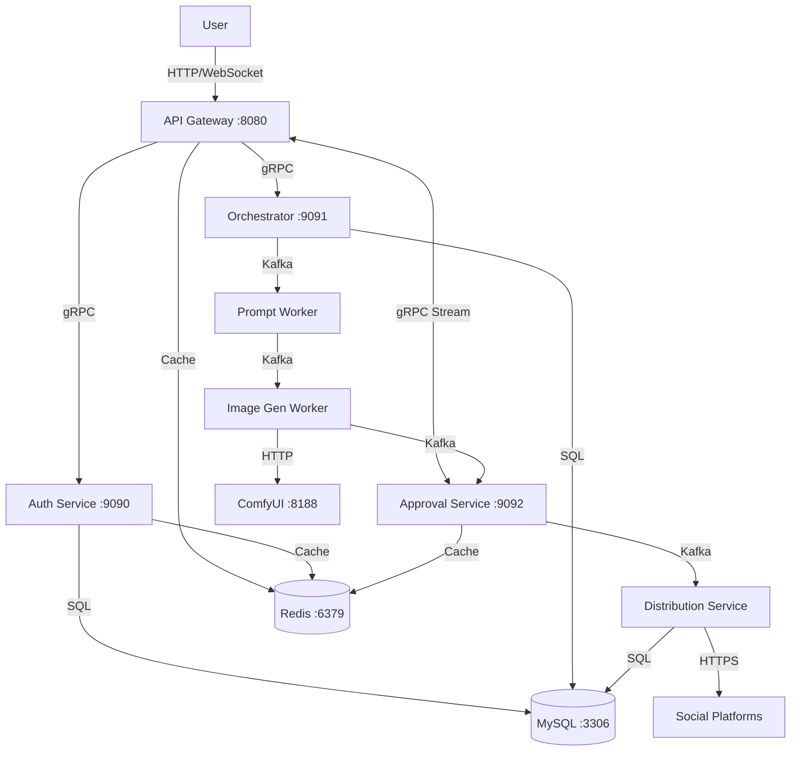

# MyAgent Architecture

## Overview

MyAgent is an AI-powered image editing and social distribution pipeline with a microservices architecture. The repository uses a **refactored layout**: domain code under `internal/` (by capability), shared contracts and infrastructure under `pkg/`, and thin binaries under `cmd/`. For exhaustive configuration and API details, see `.cursor/rules/myagent-architecture.mdc`.

## System Architecture



## Directory Structure

### Core Application (`cmd/`)

Service entrypoints following the standard Go layout:

```
cmd/
├── api-gateway/      # Public HTTP + WebSocket entry (:8080)
├── auth-service/     # Authentication gRPC server (:9090)
├── orchestrator/     # Job orchestration gRPC server (:9091)
├── approval-service/ # Approval gRPC streaming server (:9092)
├── prompt-agent/     # Prompt refinement Kafka worker
├── image-gen-agent/  # Image generation Kafka worker
├── distribution/     # Distribution Kafka consumer
└── migrate/          # Database migration CLI tool
```

### Business Logic (`internal/`)

Domain-driven organization by business capability:

```
internal/
├── apigateway/           # API gateway (HTTP + WebSocket)
│   ├── gateway.go        # Route registration
│   ├── auth_handlers.go  # Registration, login, OAuth
│   ├── job_handlers.go   # Job submission, approval
│   ├── websocket_handlers.go
│   ├── grpc_helpers.go
│   └── proto_converters.go
│
├── auth/                 # Authentication domain
│   ├── handler.go        # gRPC server
│   ├── service.go        # Auth business logic
│   └── repository.go     # User data access
│
├── jobs/                 # Job processing domain
│   ├── orchestrator/     # Job orchestration
│   ├── approval/         # Job approval workflow
│   └── distribution/     # Multi-platform distribution
│
├── workers/              # Kafka workers
│   ├── promptagent/      # LLM prompt refinement
│   └── imagegenagent/    # ComfyUI image generation
│
├── platforms/            # Platform integrations
│   └── credentials/      # Encrypted platform credentials
│
└── config/               # Configuration loading (Viper)
```

### Shared Libraries (`pkg/`)

Reusable packages organized by function:

```
pkg/
├── infrastructure/       # Infrastructure concerns
│   ├── bootstrap/        # Service initialization
│   ├── grpcserver/         # gRPC server utilities
│   ├── httpserver/         # HTTP server utilities
│   └── otel/               # OpenTelemetry tracing
│
├── middleware/           # HTTP middleware
│   ├── auth/               # JWT authentication
│   └── ratelimit/          # Rate limiting
│
├── data/                   # Data layer
│   ├── mysql/              # MySQL pool and migrations
│   ├── redis/              # Redis client
│   └── kafka/              # Kafka producer/consumer
│
├── types/                  # Shared types (config, domain, contracts, events, constants)
├── events/                 # Event publishing helpers
├── connectors/             # Social platform connectors
├── comfyui/                # ComfyUI HTTP client
├── crypto/                 # AES-256-GCM encryption
├── llm/                    # OpenAI client and refinement
├── logger/                 # Structured logging
├── messages/               # HTTP response messages
├── storage/                # S3 storage
├── httputil/               # HTTP helpers
├── dbutil/                 # DB JSON adapters
└── websocket/              # WebSocket hub
```

## Data Flow

### Job Submission Flow

1. User uploads image + prompt via HTTP POST to api-gateway
2. Gateway uploads to S3, forwards to orchestrator via gRPC
3. Orchestrator calls LLM to parse intent, publishes to Kafka
4. Pipeline: `prompt.refine.requested` → `prompt.refined` → `image.generated` → `image.approved`
5. Real-time updates pushed via gRPC streaming (approval → gateway → WebSocket → user)

### Authentication Flow

1. User registers/logs in via api-gateway HTTP
2. Gateway forwards to auth-service via gRPC
3. Auth-service validates credentials, issues JWT
4. Gateway returns JWT to user
5. All protected endpoints validate JWT via middleware (checks Redis blacklist)

### Distribution Flow

1. User approves generated image via HTTP POST to api-gateway
2. Gateway calls orchestrator via gRPC
3. Orchestrator publishes `image.approved` to Kafka
4. Distribution service consumes event
5. Loads encrypted credentials from database
6. Fans out to selected platforms in parallel
7. Records results per platform

## Key Design Decisions

### API Gateway Pattern

- **Single public entry point** reduces attack surface
- OAuth callbacks must be HTTP (provider requirement)
- Internal services use gRPC for efficiency
- Gateway handles rate limiting, CORS, JWT validation

### gRPC vs HTTP vs Kafka

- **HTTP**: External traffic, OAuth callbacks, WebSocket
- **gRPC**: Service-to-service, high-frequency calls (e.g. JWT validation)
- **Kafka**: Async workflows and long-running work (image generation)

### Credential Security

- Platform tokens encrypted at rest (AES-256-GCM)
- Per-user credentials (multi-tenant)
- Secrets are not global service configuration
- Decrypted at distribution time when posting

### Shared types

Application-wide structs and constants live in **`pkg/types`**. Import that package for config shapes, domain models, HTTP contracts, Kafka event payloads, and shared constants.

## Technology Stack

| Component       | Technology              | Port   |
|----------------|-------------------------|--------|
| **API Gateway**| Go + Gin + WebSocket    | 8080   |
| **Services**   | Go + gRPC               | 9090–9092 |
| **Database**   | MySQL                   | 3306   |
| **Cache**      | Redis                   | 6379   |
| **Message Queue** | Kafka                | 9092   |
| **Tracing**    | OpenTelemetry + Jaeger  | 4317   |
| **Storage**    | AWS S3                  | —      |
| **Image Gen**  | ComfyUI                 | 8188   |
| **LLM**        | OpenAI GPT-4            | —      |

## Performance Characteristics

| Metric              | Value        | Notes                          |
|---------------------|-------------|--------------------------------|
| **JWT Validation**  | < 1ms       | Redis blacklist check          |
| **Job Submission**  | < 100ms     | S3 upload + DB write           |
| **Image Generation**| 30–60s      | ComfyUI processing             |
| **Distribution**    | 2–10s       | Parallel platform posting      |
| **gRPC Overhead**   | Lower latency | vs REST for internal calls   |

## Observability

### Tracing

- OpenTelemetry spans on service boundaries
- Trace context propagated through Kafka events
- Correlation in Jaeger (or compatible backend)

### Logging

- Structured JSON logs (zap)
- Trace ID and span ID in logs

### Metrics

- Application-level metrics can be added where needed
- gRPC/HTTP instrumentation where enabled

## Scalability

### Horizontal Scaling

- **API Gateway**: Stateless; load balance with shared Redis
- **Workers**: Kafka consumer groups for parallelism
- **Services**: Stateless gRPC servers

### Bottlenecks

- **ComfyUI**: Often a single external instance
- **MySQL**: Shared; can shard or scale read replicas by need
- **S3**: Managed object storage

## Security

1. **Authentication**: JWT with Redis blacklist
2. **Authorization**: Role-based access control (RBAC)
3. **Encryption**: AES-256-GCM for credentials at rest
4. **Network**: Internal gRPC services not exposed publicly
5. **Input Validation**: User inputs validated at the gateway

## Roadmap (optional)

- Broader unit and integration test coverage
- Circuit breakers for external dependencies
- Prometheus metrics and dashboards
- CI/CD and container images
- Kubernetes-style deployment manifests

## Documentation

- **This file (`ARCHITECTURE.md`)** — High-level layout, flows, and design
- **`.cursor/rules/myagent-architecture.mdc`** — Detailed technical reference (ports, contracts, Redis keys, lifecycle)
- **`README.md`** — Project setup when present
- **`pkg/**/doc.go`** — Package-level notes where added
